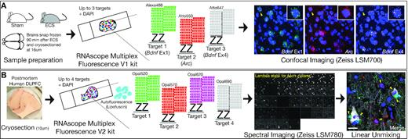

# Image segmentation (Visium)


## Overview

As we saw in the introduction to [Spatially resolved transcriptomics], the Visium platform from 10x Genomics has four tissue capture areas. 

```{r, echo=FALSE, out.width = "60%", fig.align="center", fig.cap="Visium slide design. Source: [10x Genomics](https://kb.10xgenomics.com/hc/en-us/articles/360035487572-What-is-the-spatial-resolution-and-configuration-of-the-capture-area-of-the-Visium-Gene-Expression-Slide-)."}
knitr::include_graphics("https://kb.10xgenomics.com/hc/article_attachments/360042142472/Picture1.png")
```

While 10x Genomics will provide the Visium slide, you can use many different imaging scopes to obtain bright field and/or fluorescent images for regular Visium or Visium immunofluorescence (IF), respectively.

```{r, echo=FALSE, out.width = "75%", fig.align="center", fig.cap="Visium images you might generate using your preferred imaging scope: bright field images showing the tissue or multi-channel fluorescent images. Source: [10x Genomics](https://support.10xgenomics.com/spatial-gene-expression/software/pipelines/latest/using/input-recommendations)."}
knitr::include_graphics("https://support.10xgenomics.com/img/spatial/tissue_lowres_image_brightfield.png")
```

As we will learn in the next chapters, we will want to use the [Loupe Browser (Visium)] to manually align each tissue capture area prior to running [Space Ranger (Visium)] for processing the gene expression data.

```{r, echo=FALSE, out.width = "75%", fig.align="center", fig.cap="A single Visium tissue capture area with the fiducial frame aligned through Loupe such that the red circles overlap the fiducial frame as determined by visual inspection. Source: [10x Genomics](https://support.10xgenomics.com/spatial-gene-expression/software/pipelines/latest/output/images)."}
knitr::include_graphics("https://support.10xgenomics.com/img/spatial/aligned_fiducials.jpg")
```

You likely will image a full Visium slide with four tissue capture areas. So before you can proceed, you will need to use some external software to split your image into individual capture areas. One such utility is [`VistoSeg`](http://research.libd.org/VistoSeg/) which we will illustrate in this chapter.


## What is VistoSeg?

[`VistoSeg`](http://research.libd.org/VistoSeg/) is a MATLAB pipeline used to process, analyze, and interactively visualize the high-resolution histology images from the 10x Genomics Visium experiment @Tippani2021. The output from `VistoSeg` is the estimated number of cells per spot, which can used for downstream analyses. `VistoSeg` can also be used prior to running `Loupe` as it can help create high resolution images for each Visium tissue section. The main steps in `VistoSeg` are as follows:

- *Split Image*: This step is used to split the large Visium histology whole slide image into individual capture areas, creating four individual `.tif` files. These images can then be used with [Loupe Browser (Visium)]
- *Nuclei Segmentation*: This is a two-step process where nuclei segmentation is performed for images. Nuclei segmentation is followed by a refining step to get a cleaner image of the nuclei segmentation.
- *Space Ranger*: as in you need to run `spaceranger count`, described in the [Space Ranger (Visium)] chapter, to create the input files for the next `VistoSeg` step
- *Count Cells/Nuclei*: This step is performed to get the count of cells/nuclei per Visium spot for each capture area

```{r, echo=FALSE, out.width = "100%", fig.align="center", fig.cap="`VistoSeg` pipeline overview. Source: [`VistoSeg`](http://research.libd.org/VistoSeg/index.html#why-spatial-transcriptomics-or-visium-imaging)."}
knitr::include_graphics("http://research.libd.org/VistoSeg/images/VistoSeg.png")
```

For more information about `VistoSeg` please see [its documentation website](http://research.libd.org/VistoSeg/).

## Split histology images

[`VistoSeg`](http://research.libd.org/VistoSeg/) provides a MATLAB function called `splitSlide` that can take an image with four capture areas and divide into four images with approximately the same dimensions (they can be a few pixels off in the X-axis). Sometimes the center of the image is not the center of the slide, in such case the offset can be adjusted manually.

```{r, echo=FALSE, out.width = "100%", fig.align="center", fig.cap="An example bright field image with four Visium tissue capture areas. Source: [`VistoSeg`](http://research.libd.org/VistoSeg/step-1-split-visium-histology-whole-slide-image-into-individual-capture-area-images.html)."}
knitr::include_graphics("http://research.libd.org/VistoSeg/images/img1.png")
```

Example images for trying out `splitSplide` and the corresponding code are available from the [`VistoSeg` documentation website](http://research.libd.org/VistoSeg/step-1-split-visium-histology-whole-slide-image-into-individual-capture-area-images.html).


### File size issues

As noted on the [`VistoSeg` software requirements](http://research.libd.org/VistoSeg/index.html#software-requirements), high quality images for a full Visium slide can be as big as ~25 GB each. This means that you will need plenty of memory in order to load the full Visium slide image into MATLAB before you can run `splitSlide`. This could be two or three times the amount of the image size on disk. Once you have run `splitSlide`, the rest of the `VistoSeg` pipeline can run on a machine with 16 GB of RAM (or even less).

## Segment cell nuclei

Once you have run the `splitSlide` function from `VistoSeg`, you can now proceed to segment the images. This process helps remove background noise in the images so you can more readily identify the cells or nuclei in your bright field image. For fluorescent images, `dotdotdot`'s utilities @Maynard2020 could potentially be useful, particularly if your images have Z-stacks. 

```{r, echo=FALSE, out.width = "80%", fig.align="center", fig.cap="`dotdotdot` overview figure. Notice the Z stacked images which some scopes produce. Source: [`dotdotdot`](https://doi.org/10.1093/nar/gkaa312)."}

```

`VistoSeg` provides two functions: `VNS` (Visium Nuclei Segmentation) and `refineVNS` which are used to perform the cell/nuclei segmentation on regular bright field images. This process involves choosing the total number of visually distinguishable colors in the image (5 in our sample image) and running MATLAB's [Color-Based Segmentation Using K-Means clustering](https://www.mathworks.com/help/images/color-based-segmentation-using-k-means-clustering.html).

```{r, echo=FALSE, out.width = "75%", fig.align="center", fig.cap="Color cluster 3 is the one that best corresponds to the nuclei for an example capture area image shown in the `VistoSeg` documentation. Pixels corresponding to this cluster are shown in grey and the remaining background pixels in green. Source: [`VistoSeg`](http://research.libd.org/VistoSeg/step-1-split-visium-histology-whole-slide-image-into-individual-capture-area-images.html)."}
knitr::include_graphics("http://research.libd.org/VistoSeg/images/sampleimage_index3.png")
```

For more information and a detailed example check the [`VistoSeg` documentation website](http://research.libd.org/VistoSeg/step-1-split-visium-histology-whole-slide-image-into-individual-capture-area-images.html).

## Identify number of cells per spot

`VistoSeg` has two utilities for estimating the number of cells per spot. However, before you can use them, you need to first align the individual tissue capture areas using [Loupe Browser (Visium)]. This process is key in order to identify the centers of each of the Visium spots and their coordinates in the images. As long as all downstream segmented images use the exact same proportions as the input image for `Loupe`, we can compute a scaling factor and use it for computing the coordinates of the Visium spots in the new images. [Space Ranger (Visium)] will provide us the spot coordinate file as well as process the gene expression data. The spot coordinate files will enable us to estimate the number of cells per spot `VistoSeg` as shown in the [Space Ranger (Visium)] chapter.

## Wrapping up

In this chapter we learned that Visium experiments can be trickier than expected. That is, before we can use the processing tools provided by 10x Genomics, we have to learn how to work with the images we generate. Given the broad spectrum of imaging scopes, it is not surprising that 10x Genomics does not support this. However, [`VistoSeg`](http://research.libd.org/VistoSeg/) among other software, can help us split our images and process them in such a way that we will be able to estimate the number of cells or nuclei per Visium spot. 
