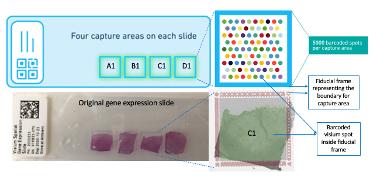

# (PART) Preprocessing steps {-}

# Preprocessing steps

In this part, we describe several crucial preprocessing steps required to prepare raw data files to load the data into R. These steps require the use of several tools outside Bioconductor. In the examples, we primarily focus on data from the 10x Genomics Visium platform.

```{r, echo=FALSE, out.width = "100%", fig.align="center", fig.cap="An overview of the Visium technology by 10x Genomics for generating spatially resolved transcriptomics data. Each Visium slide has four tissue capture areas. Each of these capture areas has about 5000 barcoded spots. The tissue capture areas are delineated by a fiducial frame that is useful for aligning the images and determining the location of the spots in order to map the gene expression data with the imagning data. Source: [`VistoSeg`](http://research.libd.org/VistoSeg/)."}

```

