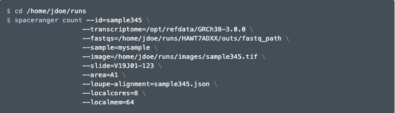

# Space Ranger (Visium)


## Overview

In this chapter, you will learn the basics about the [`spaceranger count`](https://support.10xgenomics.com/spatial-gene-expression/software/pipelines/latest/what-is-space-ranger) processing pipeline by 10x Genomics for Visium data, and the [`VistoSeg`](http://research.libd.org/VistoSeg/) software you can use for segmenting the images to estimate the number of the cells per spot.

## What is Space Ranger?

Space Ranger is a set of analysis pipelines for processing 10x Genomics Visium sequence data ([`FASTQ`](https://en.wikipedia.org/wiki/FASTQ_format) files) with high resolution microscope images of tissue. In short, it maps the transcriptomic reads to the microscope image of the tissue from which the reads were obtained. Space Ranger includes 5 pipelines but we only use one for our work with Visium -- this is the `spaceranger count` pipeline. 

You can find more information about the various pipelines [on the 10x Genomics website](https://support.10xgenomics.com/spatial-gene-expression/software/pipelines/latest/what-is-space-ranger).


## Installing Space Ranger

Installing Space Ranger is fairly simple and can be completed in around 3 steps which can be found [in their documentation](https://support.10xgenomics.com/spatial-gene-expression/software/pipelines/latest/installation). Briefly, these are:

1. Download and unpack the Space Ranger `.tar.gz` file in any location
1. Download and unpack any of the reference data `.tar.gz` file in a convenient location
1. Pre-pend the Space Ranger directory to your `$PATH`

If you use the [`lmod`](https://lmod.readthedocs.io/en/latest/) software management utility in your high performance computing environment, you can create a module with commands such as the ones described at:

* [JHPCE module source](https://github.com/LieberInstitute/jhpce_mod_source/tree/master/spaceranger/1.3.0) for `spaceranger` version 1.3.0
* [JHPCE module config](https://github.com/LieberInstitute/jhpce_module_config/blob/master/spaceranger/1.3.0.lua) for `spaceranger` version 1.3.0

Thus in the future, you can use `spaceranger` with commands such as

```{bash, eval = FALSE}
 $ module load spaceranger/1.3.0
Loading LIBD module for spaceranger/1.3.0
Reference files, for use with the '--transcriptome' argument, can be
accessed or downloaded into
/dcl01/ajaffe/data/lab/singleCell/cellranger_reference/.

$ spaceranger --help
spaceranger spaceranger-1.3.0
Process 10x Genomics Spatial Gene Expression data

USAGE:
    spaceranger <SUBCOMMAND>

FLAGS:
    -h, --help       Prints help information
    -V, --version    Prints version information

SUBCOMMANDS:
    count               Count gene expression and feature barcoding reads
                        from a single capture area
    aggr                Aggregate data from multiple 'spaceranger count'
                        runs
    targeted-compare    Analyze targeted enrichment performance by
                        comparing a targeted sample to its cognate parent
                        WTA sample (used as input for targeted gene
                        expression)
    targeted-depth      Estimate targeted read depth values (mean reads
                        per spot) for a specified input parent WTA sample
                        and a target panel CSV file
    mkfastq             Run Illumina demultiplexer on sample sheets that
                        contain 10x-specific sample index sets
    testrun             Execute the 'count' pipeline on a small test
                        dataset
    mat2csv             Convert a gene count matrix to CSV format
    mkref               Prepare a reference for use with 10x analysis
                        software. Requires a GTF and FASTA
    mkgtf               Filter a GTF file by attribute prior to creating
                        a 10x reference
    upload              Upload analysis logs to 10x Genomics support
    sitecheck           Collect linux system configuration information
    help                Prints this message or the help of the given
                        subcommand(s)
```


## Run spaceranger count

The `spaceranger count` pipeline requires several inputs (the microscope image and `FASTQ` files) and performs sequence alignment, tissue detection and alignment using the fiducial frame, and barcode/UMI counting. The most important output is the gene-spot matrix which we combine with other data generated by [`VistoSeg`](http://research.libd.org/VistoSeg/) (see below) into a [`SpatialExperiment`](http://bioconductor.org/packages/SpatialExperiment/) R object for downstream analysis. 

A more detailed description of this pipeline can be found [here](https://support.10xgenomics.com/spatial-gene-expression/software/pipelines/latest/using/count). 
	
Here is an example of the parameters used to run `spaceranger count`. Note how we are using the gene annotation information provided by 10x Genomics, which is actually the same data they provide for their single cell data processing software called Cell Ranger. So if you have both types of data, you can save some disk space by re-using these gene annotation files. One important input file is the `--loupe-alignment` file, which is why you'll need to use [Loupe Browser (Visium)] first.

```{r, echo=FALSE, out.width = "100%", fig.align="center", fig.cap="`spaceranger count` example usage."}

```


## Output files

The `spaceranger count` pipeline outputs the following files. The ones we use for downstream analysis are the files contained in the `raw_features_bc_matrix` folder and can be imported into R using the `SpatialExperiment::read10xVisium()` function.

```{r, echo=FALSE, out.width = "40%", fig.align="center", fig.cap="`spaceranger count` output files."}
knitr::include_graphics("images/space_ranger_output.png")
```

Among the output files, we have the two image files:

* `tissue_lowres_image.png`: max 600 pixels
* `tissue_hires_image.png`: max 2000 pixels

though you might have a much higher quality image than the `hires` one that is proportional to these two. The `scalefactors_json.json` file includes the scaling factors to convert spot coordinates to pixel coordinates from either the `lowres` or `highres` image. The spot coordinates information is stored in the `tissue_positions_list.csv` text file. In addition, you might be interested in the `metrics_summary.csv` file ^[Note that the format of this file has changed across `spaceranger` versions.] which includes the metrics displayed in the interactive website `web_summary.html`. While it is nice that `spaceranger count` provides files in the `filtered_feature_bc_matrix` directory with the data filtered to the spots overlapping tissue, as determined by your [Loupe Browser (Visium)] alignment file, we recommend using the `raw_feature_bc_matrix` data. Doing so will enable you to inspect the data in spots that theoretically don't overlap your tissue. Then later on, you can easily filter out those spots when using `SpatialExperiment`.

If you are interested in accessing some `spaceranger count` output files, 10x Genomics provides [several public datasets](https://support.10xgenomics.com/spatial-gene-expression/datasets) that you can use. You can also access the `spatialLIBD` data from [this collection of links](https://github.com/LieberInstitute/HumanPilot#raw-data) @Maynard2021.


## Web summary .html file

The web summary `web_summary.html` is the first file we look at after Space Ranger is done running because it tells us if the run was successful. It provides general quality control statistics and visualizations. These include clustering results using k-means and graph-based clustering methods visualized on reduced dimensions such as t-SNE and UMAP. One metric that you might want to check is the number of reads per spot overlapping tissue, since according to 10x Genomics, you should target 50,000 mean reads per spot. If you are too low, the median number of genes per spot will suffer and you might need to consider sequencing your cDNA library a bit more.

```{r, echo=FALSE, out.width = "100%", fig.align="center", fig.cap="Basic summary portion of the `web_summary.html` file."}
knitr::include_graphics("images/web_summary.png")
```

The `.cloupe` file is also useful for checking the quality of the data. There is more information on this file in the [Loupe Browser (Visium)] chapter of this book. 


## Import outputs into R

We use the [`SpatialExperiment`](https://bioconductor.org/packages/SpatialExperiment) package to store the data from Space Ranger and `VistoSeg` (see below) in one convenient object (`spe`). Below is an example of the code we use to build the `spe` object.

```{r, echo=FALSE, out.width = "40%", fig.align="center", fig.cap="Example `SpatialExperiment::read10xVisium()` function call. This example will load the data from multiple Visium tissue sections since `sample_info$sample_path` and `sample_info$sample_id` are vectors of length greater than one. This can be quite useful for downstream analyses where you want to perform quality control, dimension reduction, clustering, etc across all Visium tissue sections instead of one tissue section at a time."}
knitr::include_graphics("images/build_spe.png")
```


## VistoSeg for quantifying cells per spot

As was explained earlier in [What is VistoSeg?], [`VistoSeg`](http://research.libd.org/VistoSeg/) is a MATLAB pipeline that can be used to estimate the number of cells per spot, which can used for downstream analyses @Tippani2021. It is ideal to first segment the bright field images as described in the [Image segmentation (Visium)] chapter. `VistoSeg` can also be used prior to running `Loupe` as it can help create high resolution images for each Visium tissue section. In particular, `VistoSeg` provides a graphical user interface (GUI) that can be be used for counting the number of cells or nuclei in the Visium spots of a given tissue capture area. This is described in detail in the [`VistoSeg` documentation website chapter 4](http://research.libd.org/VistoSeg/step-4-gui-to-count-nuclei-in-a-visium-spot.html). 


```{r, echo=FALSE, out.width = "100%", fig.align="center", fig.cap="A screenshot of the `spotspotcheck` GUI from `VistoSeg` that can be used for counting the number of cells or nuclei per Visium spot. Source: [`VistoSeg`](http://research.libd.org/VistoSeg/step-4-gui-to-count-nuclei-in-a-visium-spot.html)."}
knitr::include_graphics("http://research.libd.org/VistoSeg/images/zoom%20in%202.png")
```

In addition to `spotspotcheck`, you will need to use the `countNuclei` MATLAB function. Actually, `spotspotcheck` is optional though we highly recommend using it to visually inspect the results prior to running `countNuclei`. `countNuclei` will then estimate the number of cells/nuclei per Visium spot for each capture area. The output is saved in a spreadsheet file (`tissue_spot_counts.csv`) that contains one row per Visium spot barcode and a column with the estimated number of cells per spot. The data for nuclei counts for the tissue per Visium spot can then be incorporated with the outputs of Space Ranger by being stored in the `SpatialExperiment` object or used for downstream analysis such as @Maynard2021.

For more information about `VistoSeg` please see [its documentation website](http://research.libd.org/VistoSeg/).

## Wrapping up

By now you are familiar with how to use `Loupe` to align your images with the Visium fiducial frame, how to run `spaceranger count` to process the gene expression data, and how `VistoSeg` can help you with creating the images for `Loupe` as well as estimating the number of spots per cell. The next chapters will walk you through several of the analysis steps you can do with R and Bioconductor.

